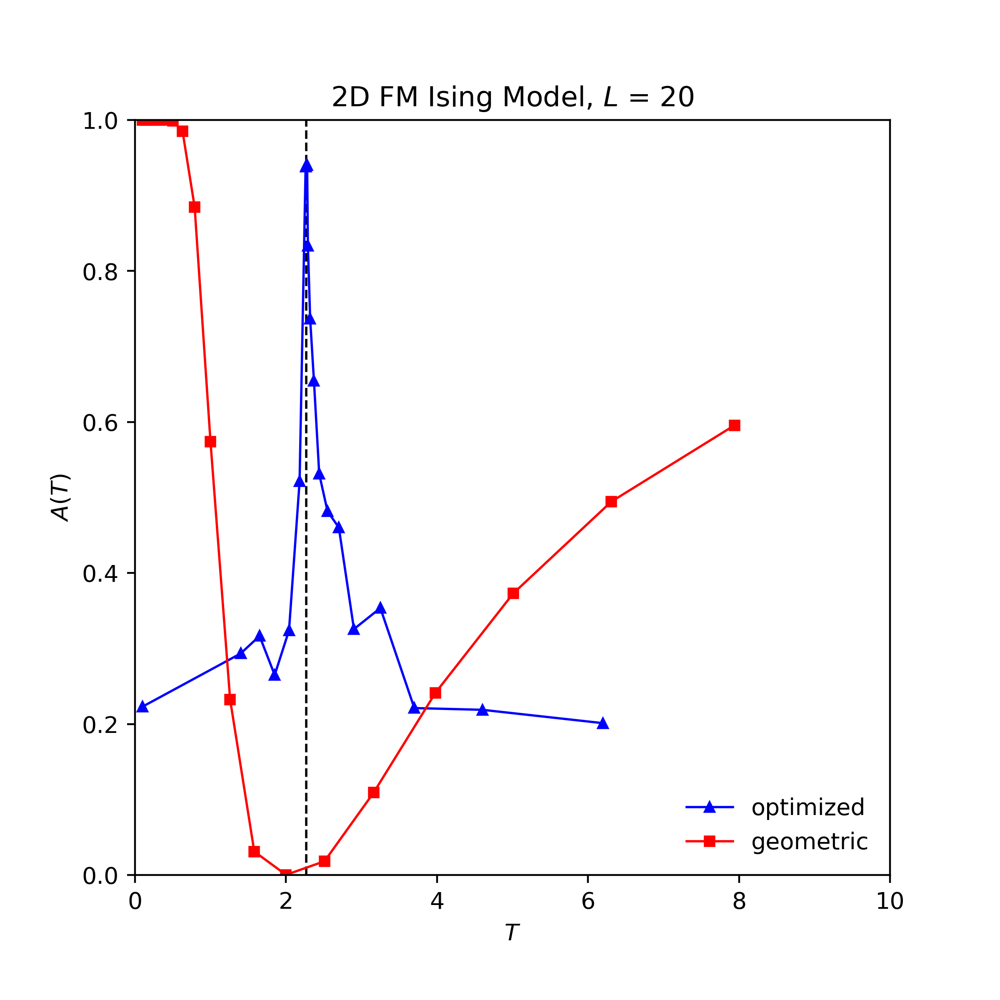

# parallel_tempering

C implementation of parallel tempering for the 2D Ferromagnetic Ising Model.  Acceptance probabilities, A(T), are estimated given a temperature set.  In the ```results``` folder, ```config_geo.txt``` and ```config_opt.txt``` are configuration files specifying "geometric" and "optimized" temperature sets.  Simulation output includes a plot of A(T) vs. T similar to Fig. 5 in [Katzgraber, et al., 2006](https://arxiv.org/abs/cond-mat/0602085): 



## Requirements

- gcc 8.1.0
- GSL
- openMP

## Installation

Clone the repo to a local directory.

## Usage

Edit system size, temperature set, and other simulation parameters in ```config.txt```.  In a bash shell, run ```make``` and then ```./parallel_tempering```.  1.1e6 sweep-exchange updates takes about 3.5min on a 2.7 GHz Intel Core i7 laptop.

